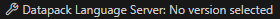

# Java Edition Datapack Language Server
> Validate and autocomplete your Minecraft Java Edition datapack files.

This extension provides you with a language server that will check your datapack files for syntax errors and provide you with autocompletion for all components that are supported by the current Paper / Minecraft version.
Therefore, it spins up a Paper Server in the background, which will load your datapack and provide the language server with the necessary information.

## Features
The extension does support the following features:

### Validation
Validate your datapack files with the help of the language server. The language server will check for syntax errors and provide you with a list of errors and warnings.

#### .mcfunction
The .mcfunction will be scanned for syntax errors, NBT properties and missing references.  
Starting with version 1.20.5, the language server will also check for the correct usage of components.
This works for all components that are supported by the current Paper / Minecraft version.

#### Loot Tables, Item Modifiers, Predicates
The language server will check for syntax errors and missing references.

#### Recipes
The language server will check for syntax errors and missing references.

### Autocompletion
The language server will provide you with autocompletion for all components that are supported by the current Paper / Minecraft version.
Simply start typing and the language server will provide you with a list of possible completions.

### Code Actions
The language server will provide you with code actions for common problems:

#### Convert to 1.20.5 format
[Version 1.20.5](https://www.minecraft.net/en-us/article/minecraft-java-edition-1-20-5) introduced a new format for items and their respective NBT data, called components.
The language server will provide you with a code action to convert your NBT data to the new format:

You can also convert the entire file to the new format or all files in the entire workspace by executing the command `Datapack: Convert all commands to 1.20.5 format (Open Editor)` or `Datapack: Convert all commands to 1.20.5 format (Workspace)` in the command palette:

## Requirements
- Java version, needed to run a Paper Server for the requested version, installed on your system. (Recommended: Java 21)
- At least 1.5 GB of RAM available for the Paper Server.

## Configuration
The extension will automatically activate, when there is a `pack.mcmeta` file in the root directory of your project.
You can then select the version of the Paper Server you want to use by clicking on the Version Selector in the status bar  
  
or by clicking on the notifcation that will appear in the bottom right corner of your screen

If the version you want to use is not available, you can update the list of available versions by executing the command `Datapack: Update available versions` in the command palette.  

## Known Issues
### I created a new loot table, item modifier, predicate or recipe, but the language server does not recognize it.
- The language server will only recognize files that are already loaded by the Paper Server.  
  To load the new files, you can execute the command `Datapack: Reload Data Pack` in the command palette.

----------------
Copyright (c) Chrotos.net. All rights reserved.

Licensed under the [MIT](LICENSE.md) license.

NOT AN OFFICIAL MINECRAFT PRODUCT. NOT APPROVED BY OR ASSOCIATED WITH MOJANG.